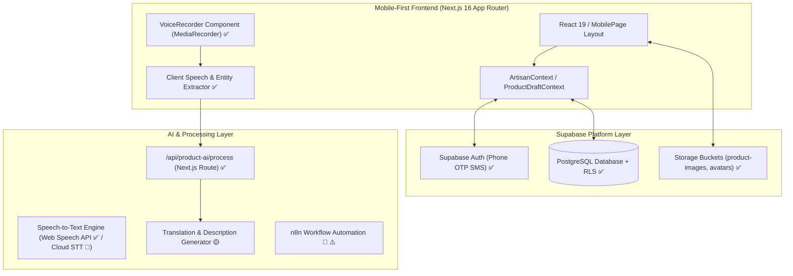
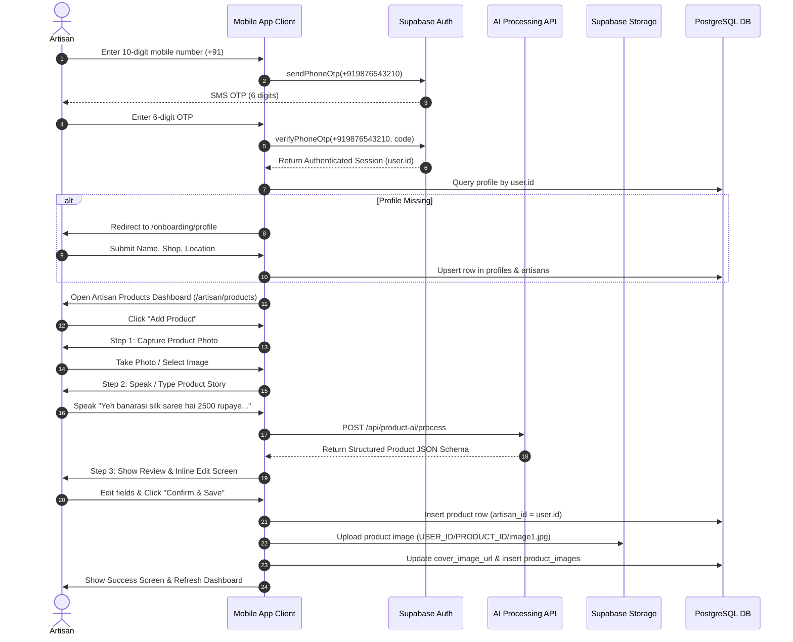
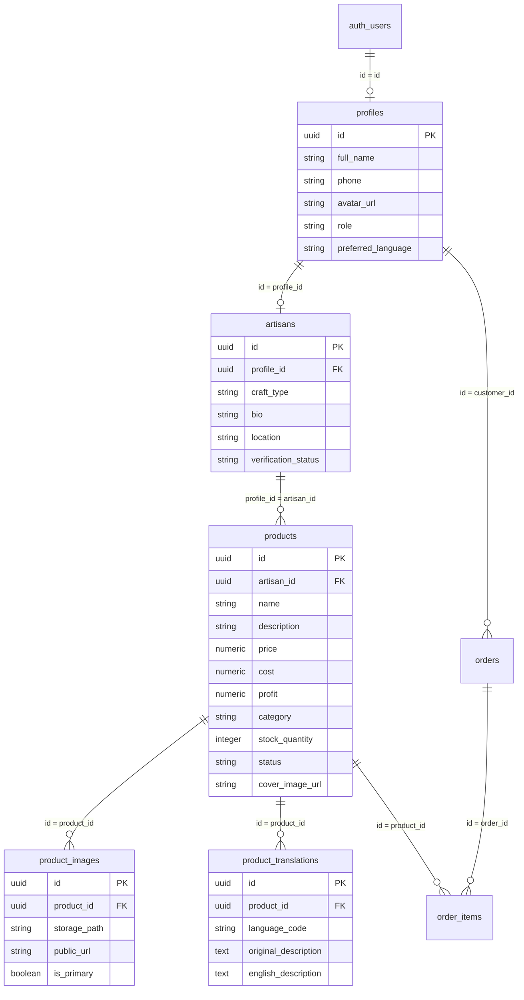

# KarigarAI (ArtSathi) — Technical Architecture Documentation

> **Document Version**: 1.0.0  
> **Last Updated**: August 2026  
> **Target Audience**: Software Architects, Senior Developers, Full-Stack Engineers, AI Pipeline Engineers  
> **Status Legend**:
> - ✅ **Implemented**: Fully built, connected, and functioning in the codebase.
> - 🟡 **Partially Implemented**: UI/Interface built with partial backend wiring or fallback logic.
> - 🔴 **Planned / Not Implemented**: Architected design target not yet integrated into source code.
> - ⚠️ **Requires Configuration**: Requires active API keys, external service endpoints, or provider setup.

---

## 1. PROJECT OVERVIEW

**KarigarAI** (also known as **ArtSathi**) is a mobile-first digital assistant and catalog management platform designed for rural and semi-urban artisans across India.

### Primary Users
- **Artisans / Karigars**: Craftspeople, weavers, potters, sculptors, and folk artists with varying levels of digital literacy and formal education.
- **Customers / Buyers**: Individuals seeking authentic, hand-crafted products directly from verified Indian artisans.

### Core Problem Solved
Traditional e-commerce platforms demand complex form-filling, product photography compliance, English text descriptions, SKU management, and pricing calculations. These barriers prevent millions of traditional Indian artisans from accessing global digital marketplaces.

### Core Concept
> An artisan should be able to use voice, images, and simple interactions to digitize their products and manage their digital presence without requiring advanced digital literacy.

### Primary User Journey
1. **Phone OTP Sign-In**: Quick sign-in using 10-digit Indian mobile numbers (`+91`) and 6-digit SMS OTP.
2. **Onboarding**: Simple profile setup capturing Name, Craft Specialization, Shop Name, and Location.
3. **AI Product Listing**: Capture/select a product photo, speak or type a natural language product story in a regional language (Hindi, Tamil, Bengali, Telugu, Gujarati, Marathi, etc.), and let AI extract structured listing fields (Category, Material, Price, Quantity, Craft Type).
4. **Human Review & Edit**: Review AI-generated listing details, make inline corrections, and confirm.
5. **Real-time Catalog Persistence**: Product data and images persist to Supabase PostgreSQL and Storage immediately, populating the artisan's live sales dashboard.

---

## 2. HIGH-LEVEL ARCHITECTURE

KarigarAI follows a mobile-first client architecture integrated with a serverless backend ecosystem powered by **Supabase** (Auth, Database, Storage) and an **AI Entity Extraction Engine** (Next.js Server API + Client NLP Parser).



### Component Implementation Status
| Component | Status | Description |
| :--- | :---: | :--- |
| **Mobile-First Client** | ✅ | Responsive mobile layout, navigation, and PWA ready |
| **Phone OTP Auth** | ✅ | Supabase Auth SMS OTP (`signInWithOtp`, `verifyOtp`) |
| **PostgreSQL Database** | ✅ | Tables: `profiles`, `artisans`, `products`, `product_images`, `product_translations`, `orders` |
| **Storage Buckets** | ✅ | `product-images` and `avatars` with RLS policies |
| **AI Processing Route** | ✅ | `/api/product-ai/process` with natural language parsing |
| **Voice Audio Input** | ✅ | Web MediaRecorder + Web Speech API browser recognition |
| **Cloud Speech-to-Text API** | 🔴 | Dedicated Cloud STT service integration |
| **n8n Workflow Engine** | 🟡 ⚠️ | Webhook integration service prepared (`n8nService.ts`) |

---

## 3. FRONTEND ARCHITECTURE

The frontend is built as a single-page style mobile web application optimized for smartphones.

### Core Stack
- **Framework**: Next.js `16.3.2` (App Router with Turbopack compiler)
- **Library**: React `19.2.8`
- **Language**: TypeScript `5.x`
- **Styling**: Tailwind CSS `v4` (`@tailwindcss/postcss`) with custom color design tokens
- **Icons**: Lucide React (`lucide-react`)
- **Backend SDK**: `@supabase/supabase-js` `^2.112.4`

### Repository Folder Structure
```text
KARIGAR/
├── .env.local                     # Environment configuration (URL, Keys)
├── next.config.ts                 # Next.js configuration
├── package.json                   # Dependencies and scripts
├── public/                        # Static public assets
├── supabase/
│   ├── migrations/                # PostgreSQL schema & RLS SQL migrations
│   └── seed.sql                   # Development seed data
├── src/
│   ├── app/                       # Next.js App Router routes & API endpoints
│   │   ├── api/
│   │   │   └── product-ai/process/ # AI processing POST endpoint
│   │   ├── artisan/
│   │   │   ├── products/          # Products list & New Product Wizard sub-routes
│   │   │   ├── profile/           # Artisan profile screen
│   │   │   └── sales/             # Sales analytics & order overview
│   │   ├── login/                 # Phone OTP Login screen
│   │   ├── onboarding/            # Language selection & profile setup screens
│   │   ├── layout.tsx             # Root layout wrapper
│   │   └── page.tsx               # Root redirect / landing page
│   ├── components/                # Reusable UI component library
│   │   ├── ai/                    # VoiceRecorder component
│   │   ├── layout/                # MobilePage wrapper & BottomNavigation
│   │   ├── products/              # ProductCard & catalog components
│   │   ├── profile/               # EditProfileModal component
│   │   ├── sales/                 # Sales metric card components
│   │   └── ui/                    # Button, Input, Toast, ProgressIndicator
│   ├── context/                   # React State Contexts
│   │   ├── ArtisanContext.tsx     # Session user, products state, toast management
│   │   ├── LanguageContext.tsx    # i18n language provider & translations
│   │   └── ProductDraftContext.tsx# Multi-step Product Wizard draft state
│   ├── data/                      # Category lists & static mock datasets
│   ├── lib/                       # Helpers & AI processing engines
│   │   ├── ai/                    # entityExtraction, photoEnhancement, pricing
│   │   ├── i18n/                  # Multi-language dictionary & support
│   │   ├── supabase/client.ts     # Supabase client singleton initialization
│   │   └── supabase.ts            # Exported Supabase client instance
│   ├── services/                  # Business logic & API communication layer
│   │   ├── ai/                    # Speech, image analysis, and product AI helpers
│   │   ├── authService.ts         # Phone OTP send/verify & session helpers
│   │   ├── n8nService.ts          # n8n webhook automation service
│   │   ├── productService.ts      # Atomic product CRUD & storage upload
│   │   ├── profileService.ts      # Profile and artisan database operations
│   │   └── salesService.ts        # Order & sales calculation service
│   └── types/                     # TypeScript definitions
│       ├── database.ts            # Supabase database schema interface
│       └── index.ts               # Application model types
```

---

## 4. USER FLOW



---

## 5. PRODUCT WIZARD ARCHITECTURE

The Product Wizard digitizes hand-crafted inventory through two wizard modes:
1. **AI Product Listing Wizard (`/artisan/products/new`)**: 4-step intelligent flow (Photo -> Voice/Text Story -> Missing Info Questions -> Preview & Confirm).
2. **Step-by-Step Manual Wizard (`/artisan/products/new/photo|story|enhance|price|sku`)**: Traditional sequential steps with progress indicators.

### 4-Step AI Listing Flow Details
- **Step 1 (Photo Capture)**: Captures camera or gallery image as base64 / blob.
- **Step 2 (Story Input)**: Voice recorder (`VoiceRecorder.tsx`) or text input captures regional description.
- **Step 3 (AI Entity Extraction)**: Calls `/api/product-ai/process` to extract `product_name`, `category`, `craft_type`, `material`, `price`, `quantity`, `production_time_days`. If required fields are missing, generates targeted questions.
- **Step 4 (Review & Save)**: Renders a preview card with inline input fields. When confirmed, executes atomic backend creation.

### Atomic Product Creation & Storage Upload Strategy
```ts
// 1. Verify authenticated user session
const { data: { user } } = await supabase.auth.getUser();

// 2. Insert database product record to generate Product ID
const { data: productRow, error } = await supabase
  .from("products")
  .insert({
    artisan_id: user.id,
    name: productData.productName,
    category: productData.category,
    craft_type: productData.craftType,
    material: productData.material,
    description: productData.description,
    price: productData.price,
    stock_quantity: productData.quantity,
    status: "published"
  })
  .select()
  .single();

// 3. Upload image to Storage bucket path: USER_ID/PRODUCT_ID/image1.jpg
const storagePath = `${user.id}/${productRow.id}/image1.jpg`;
const { error: uploadErr } = await supabase.storage
  .from("product-images")
  .upload(storagePath, imageBlob, { contentType: "image/jpeg", upsert: true });

// 4. Rollback on upload failure
if (uploadErr) {
  await supabase.from("products").delete().eq("id", productRow.id);
  throw new Error("Image upload failed. Product creation rolled back.");
}

// 5. Update cover_image_url and product_images table
const { data: urlData } = supabase.storage.from("product-images").getPublicUrl(storagePath);
await supabase.from("products").update({ cover_image_url: urlData.publicUrl }).eq("id", productRow.id);
await supabase.from("product_images").insert({
  product_id: productRow.id,
  storage_path: storagePath,
  public_url: urlData.publicUrl,
  is_primary: true
});
```

---

## 6. VOICE / AUDIO PIPELINE

KarigarAI incorporates a voice-first input pipeline for artisans who prefer speaking over typing.

```text
Microphone (Browser)
   ↓
Audio Stream (MediaRecorder / Web Speech API)
   ↓
Transliterated / Regional Text (Hindi, Tamil, Bengali, etc.)
   ↓
Natural Language Parser (entityExtraction.ts)
   ↓
Regex & Keyword Extraction (Quantity, Price, Material, Category)
   ↓
Structured Product JSON Schema
```

### Voice Pipeline Specifications
- **Input Format**: Browser `MediaRecorder` audio blobs or Web Speech API (`SpeechRecognition`) text transcripts.
- **Language Detection**: Script detection (Devanagari, Tamil, Bengali, Gujarati, Telugu) in `detectLanguage()`.
- **Speech-to-Text Status**:
  - ✅ **Web Speech API**: Client-side speech recognition in supported browsers.
  - 🔴 **Cloud STT API**: Dedicated Google Cloud Speech / Whisper API endpoint (Planned).

---

## 7. AI PRODUCT UNDERSTANDING

The AI processing engine transforms unstructured voice stories into validated, structured schema objects.

```json
{
  "product_name": "Banarasi Silk Saree",
  "category": "Saree",
  "craft_type": "Handloom Weaving",
  "material": "Silk",
  "description": "Handcrafted Banarasi silk saree woven with traditional gold zari patterns.",
  "price": 2500,
  "currency": "INR",
  "quantity": 5,
  "color": "Red & Gold",
  "dimensions": "5.5 meters",
  "weight": "600 grams",
  "production_time_days": 5,
  "origin": "Varanasi, Uttar Pradesh",
  "care_instructions": "Dry clean only",
  "tags": ["Banarasi", "Silk", "Handloom", "Saree"]
}
```

---

## 8. SUPABASE ARCHITECTURE

### Authentication
- **Provider**: Phone SMS OTP Auth (`supabase.auth.signInWithOtp`, `supabase.auth.verifyOtp`).
- **User Session**: Primary identity tied to `auth.users.id`.
- **Profile Relationship**: Every authenticated user maps to `public.profiles.id = auth.users.id` and `public.artisans.profile_id = auth.users.id`.

### Database Schema (ER Diagram)



### Storage Buckets
1. **`product-images`** (Public Access):
   - Stores product catalog photos.
   - Folder convention: `{user.id}/{product.id}/image1.jpg`.
2. **`avatars`** (Public Access):
   - Stores artisan profile avatars.
   - Folder convention: `{user.id}/avatar-{timestamp}.jpg`.

### Row Level Security (RLS)
- **`profiles`**: Public read; users can insert/update only their own record (`auth.uid() = id`).
- **`artisans`**: Public read; artisans can update only their own profile (`auth.uid() = profile_id`).
- **`products`**: Public read for `status = 'published'`; artisans can insert/update/delete only their own products (`auth.uid() = artisan_id`).
- **`product_images`**: Public read; artisans can insert/update/delete images for their products.
- **`storage.objects`**: Users can upload to buckets within folders named after their `auth.uid()`.

---

## 9. DATABASE SCHEMA TABLE

| Table | Column | Type | Nullable | Default | Relationship | Purpose |
| :--- | :--- | :--- | :---: | :--- | :--- | :--- |
| **`profiles`** | `id` | UUID | ❌ | `auth.uid()` | `auth.users(id)` | User profile primary record |
| | `full_name` | TEXT | ✅ | NULL | - | Artisan/User full name |
| | `phone` | TEXT | ✅ | NULL | - | E.164 normalized mobile number (`+91...`) |
| | `avatar_url` | TEXT | ✅ | NULL | - | Profile photo public URL |
| | `role` | UserRole | ❌ | `'artisan'` | - | User role (`'artisan'`, `'customer'`, `'admin'`) |
| | `preferred_language` | TEXT | ❌ | `'hi'` | - | Interface language preference |
| **`artisans`** | `id` | UUID | ❌ | `gen_random_uuid()` | - | Artisan details record |
| | `profile_id` | UUID | ❌ | - | `profiles(id)` | Linked user profile ID |
| | `craft_type` | TEXT | ✅ | NULL | - | Artisan craft specialization |
| | `location` | TEXT | ✅ | NULL | - | City, State location |
| | `verification_status` | Enum | ❌ | `'pending'` | - | Status (`'pending'`, `'verified'`, `'rejected'`) |
| **`products`** | `id` | UUID | ❌ | `gen_random_uuid()` | - | Product item record |
| | `artisan_id` | UUID | ❌ | - | `profiles(id)` | Authenticated artisan ID |
| | `name` | TEXT | ❌ | - | - | Product title |
| | `description` | TEXT | ✅ | NULL | - | English/Primary product description |
| | `price` | NUMERIC(10,2)| ❌ | `0.00` | - | Selling price in INR |
| | `cost` | NUMERIC(10,2)| ❌ | `0.00` | - | Material/production cost |
| | `profit` | NUMERIC(10,2)| ❌ | `0.00` | - | Estimated profit margin |
| | `category` | TEXT | ✅ | NULL | - | Category (`Textiles`, `Pottery`, etc.) |
| | `stock_quantity` | INTEGER | ❌ | `0` | - | Available stock count |
| | `status` | Enum | ❌ | `'published'` | - | Status (`'draft'`, `'published'`, `'archived'`) |
| | `cover_image_url` | TEXT | ✅ | NULL | - | Primary product photo URL |
| **`product_images`** | `id` | UUID | ❌ | `gen_random_uuid()` | - | Additional product images |
| | `product_id` | UUID | ❌ | - | `products(id)` | Associated product |
| | `storage_path` | TEXT | ❌ | - | - | Path in `product-images` bucket |
| | `public_url` | TEXT | ❌ | - | - | Public HTTP URL |
| | `is_primary` | BOOLEAN | ❌ | `false` | - | Cover image flag |

---

## 10. DATA FLOW

### 1. Authentication Flow
```text
User Phone Input (+91) ──> Supabase Auth (signInWithOtp) ──> SMS OTP Delivered
      ↓
User Code Verification ──> Supabase Auth (verifyOtp) ──> Auth Session (user.id)
      ↓
Query DB (profiles) ──> Load Profile Data ──> Populate ArtisanContext State
```

### 2. Product Creation Flow
```text
Photo & Voice Input ──> NLP Parser (entityExtraction.ts) ──> /api/product-ai/process
      ↓
JSON Product Schema ──> Artisan Review & Edit ──> Click "Confirm & Save"
      ↓
DB Insert (products) ──> Storage Upload (product-images) ──> DB Update (cover_image_url)
      ↓
Refresh ArtisanContext ──> Live Sales Dashboard Updated
```

---

## 11. API / SERVICE ARCHITECTURE

| Service / Endpoint | Purpose | Input | Output | Auth | Status |
| :--- | :--- | :--- | :--- | :--- | :---: |
| `authService.sendPhoneOtp` | Request SMS OTP code | `phone: string` | Supabase Auth Response | Public | ✅ Implemented |
| `authService.verifyPhoneOtp` | Verify 6-digit SMS OTP | `phone, token` | `{ user, session }` | Public | ✅ Implemented |
| `profileService.getProfile` | Fetch user profile | `userId: string` | Profile object | Session | ✅ Implemented |
| `profileService.updateArtisanFullProfile` | Upsert profile & artisan data | `profileData` | Updated profile | Session | ✅ Implemented |
| `productService.getArtisanProducts` | Fetch artisan products | `artisanId: string` | `Product[]` | Session / RLS | ✅ Implemented |
| `productService.createProductWithTranslations` | Create product + storage upload | `productData` | `Product` object | Session | ✅ Implemented |
| `POST /api/product-ai/process` | Extract product entities | `ProductAIProcessRequest` | `ProductAIProcessResponse` | Public | ✅ Implemented |
| `n8nService.triggerProductSyncWebhook` | Trigger n8n external workflow | `productData` | Workflow status | Webhook Key | 🟡 ⚠️ Configurable |

---

## 12. ENVIRONMENT VARIABLES

The application relies on the following environment variables defined in `.env.local`:

```text
# Supabase Configuration
NEXT_PUBLIC_SUPABASE_URL=https://<your-project-ref>.supabase.co
NEXT_PUBLIC_SUPABASE_PUBLISHABLE_KEY=pbk_...
NEXT_PUBLIC_SUPABASE_ANON_KEY=eyJ...

# Automation & External Services
NEXT_PUBLIC_N8N_BASE_URL=https://n8n.example.com/webhook

# AI API Service Keys (Configurable / Server-side)
GOOGLE_CLOUD_API_KEY=AIzaSy...
GEMINI_API_KEY=AIzaSy...
```

> ⚠️ **SECURITY WARNING**: Never expose `SUPABASE_SERVICE_ROLE_KEY` or private backend secrets in client-side `.env` or client JavaScript bundles.

---

## 13. SECURITY ARCHITECTURE

1. **Authentication**: All sensitive database writes require an active Supabase user session (`user.id`).
2. **Row Level Security (RLS)**: Enabled across all public PostgreSQL tables (`profiles`, `artisans`, `products`, `product_images`, `product_translations`). RLS policies restrict artisans from updating or deleting other users' products.
3. **Storage Security**: Bucket objects are scoped to user folder prefixes (`product-images/{user.id}/...`).
4. **Input Validation**: All client inputs (phone numbers, prices, quantities) undergo client-side and server-side validation.

---

## 14. ERROR HANDLING

- **Authentication Failures**: Displays user-friendly Hindi/English toast messages (e.g., "Kripya 6-digit ka sahi OTP code bharein").
- **Storage Upload Failures**: If image upload fails during product creation, an automatic **database rollback** deletes the newly created product row to prevent orphaned records.
- **AI Processing Failures**: If AI entity extraction fails or returns incomplete fields, the UI gracefully falls back to manual entry fields without crashing.

---

## 15. OFFLINE / NETWORK BEHAVIOR

> **Current Status**: Offline functionality is currently not implemented. Active network connection is required for Supabase Auth, database CRUD, and storage uploads. Offline draft persistence via IndexedDB / LocalStorage is planned for future releases.

---

## 16. PERFORMANCE CONSIDERATIONS

- **Image Compression**: Client-side FileReader converts camera photos to optimized web formats before upload.
- **Turbopack Build Optimization**: Next.js 16 Turbopack provides sub-second hot-reloading and modular code-splitting.
- **Database Indexing**: Primary keys, foreign keys (`artisan_id`), and status columns are indexed in PostgreSQL.

---

## 17. CURRENT VS FUTURE ARCHITECTURE

### Current Architecture (Implemented ✅)
- Mobile-first React 19 / Next.js 16 client.
- Phone OTP SMS authentication via Supabase Auth.
- Supabase PostgreSQL database + Storage buckets.
- AI Product Listing processing API (`/api/product-ai/process`) with natural language parsing.
- Real-time catalog and sales dashboard updates.

### Planned Architecture (Future Scope 🔴)
- **Cloud Speech-to-Text & Multilingual LLM**: Direct integration with Google Cloud STT & Gemini 1.5 Pro.
- **n8n Automated Marketplace Sync**: Automated product syndication to WhatsApp Business, Instagram Shopping, and ONDC.
- **Offline Draft Storage**: Progressive Web App (PWA) offline queuing with background sync when reconnected.

---

## 18. TECHNICAL DEBT

| Issue | Severity | Description | Mitigation Plan |
| :--- | :---: | :--- | :--- |
| **Mock Sales Metrics** | `MEDIUM` | `salesService.ts` currently calculates sales from simulated order records when live orders are sparse. | Connect directly to live `orders` and `order_items` queries. |
| **Speech-to-Text Fallback** | `LOW` | Uses Web Speech API which varies across Android browser versions. | Integrate server-side Whisper or Cloud STT endpoint. |
| **Local Draft Reset** | `LOW` | Draft state resides in React Context (`ProductDraftContext`). | Persist unfinished drafts to `localStorage`. |

---

## 19. DEPLOYMENT ARCHITECTURE

```text
[ Vercel / Node.js Host ] ── (HTTPS) ──> [ Next.js 16 Application ]
                                                  │
                                                  ▼
                                      [ Supabase Cloud Platform ]
                                        ├── Auth Service (SMS OTP)
                                        ├── PostgreSQL Database
                                        └── Storage Buckets
```

---

## 20. DEVELOPMENT WORKFLOW

1. **Local Setup**:
   ```bash
   npm install
   npm run dev
   ```
2. **Database Migrations**:
   Schema changes must be added to `supabase/migrations/` as sequential SQL files (e.g. `005_new_feature.sql`).
3. **Build & Typecheck**:
   ```bash
   npm run build
   ```

---

## 21. ARCHITECTURAL PRINCIPLES

1. **Mobile-First**: Designed specifically for smartphone screens and touch interactions.
2. **Artisan-First UX**: Prioritize voice, audio, and visual cues over heavy text entry.
3. **Voice-First Input**: Support natural regional speech for inventory digitization.
4. **Local-Language Friendly**: Multi-language UI support across major Indian languages.
5. **Secure by Default**: Strict Row Level Security policies on all Supabase tables.
6. **Supabase as Source of Truth**: All persistent application data resides in Supabase PostgreSQL.
7. **Structured AI Outputs**: AI processing must always output validated JSON schemas.
8. **Human-in-the-Loop Review**: Artisans must always review and approve AI listings before publishing.
9. **Zero Secret Exposure**: Never expose private API keys or service role keys in client code.
10. **Clear Implementation Boundaries**: Maintain clear separation between implemented features and planned capabilities.

---

## 22. ARCHITECTURE STATUS MATRIX

| Area | Status | Notes |
| :--- | :---: | :--- |
| **Mobile Frontend** | 🟢 Implemented | MobilePage layout, custom Tailwind theme, touch components |
| **Authentication** | 🟢 Implemented | Phone Number + 6-Digit SMS OTP via Supabase Auth |
| **Database** | 🟢 Implemented | PostgreSQL tables with full schema & RLS policies |
| **Storage** | 🟢 Implemented | `product-images` & `avatars` buckets with path conventions |
| **Product Wizard** | 🟢 Implemented | 4-step AI listing flow & manual step wizard connected to Supabase |
| **Voice Input** | 🟡 Partial | Web Speech API client recorder active; Cloud STT endpoint planned |
| **AI Processing** | 🟢 Implemented | `/api/product-ai/process` natural language entity extraction engine |
| **Translation** | 🟡 Partial | Regional script detection & English description generation |
| **Image Processing** | 🟡 Partial | Photo upload & staged enhancement service |
| **Security / RLS** | 🟢 Implemented | Comprehensive RLS policies on all tables & storage objects |
| **Deployment** | 🟢 Implemented | Production build (`npm run build`) passing cleanly |

---

## Next Recommended Technical Steps

1. **Production SMS Gateway Setup**: Configure a live SMS provider (Twilio or MessageBird) in Supabase Auth settings for production SMS delivery.
2. **Cloud Speech-to-Text Integration**: Connect Google Cloud Speech-to-Text API to handle regional audio recordings directly on the backend.
3. **LLM Vision API Integration**: Connect Gemini Vision API to automatically detect product categories and materials directly from uploaded photos.
4. **Live Orders Sync**: Replace simulated sales calculation fallback in `salesService.ts` with direct real-time aggregate queries on `orders` and `order_items`.
5. **Offline Draft Persistence**: Implement IndexedDB / LocalStorage syncing in `ProductDraftContext` to allow offline draft creation when cellular connectivity is lost.
